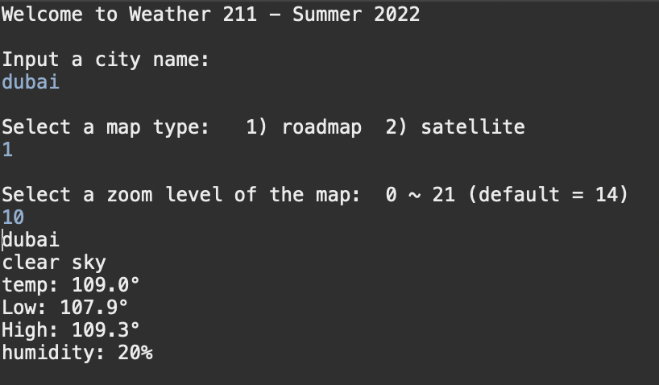
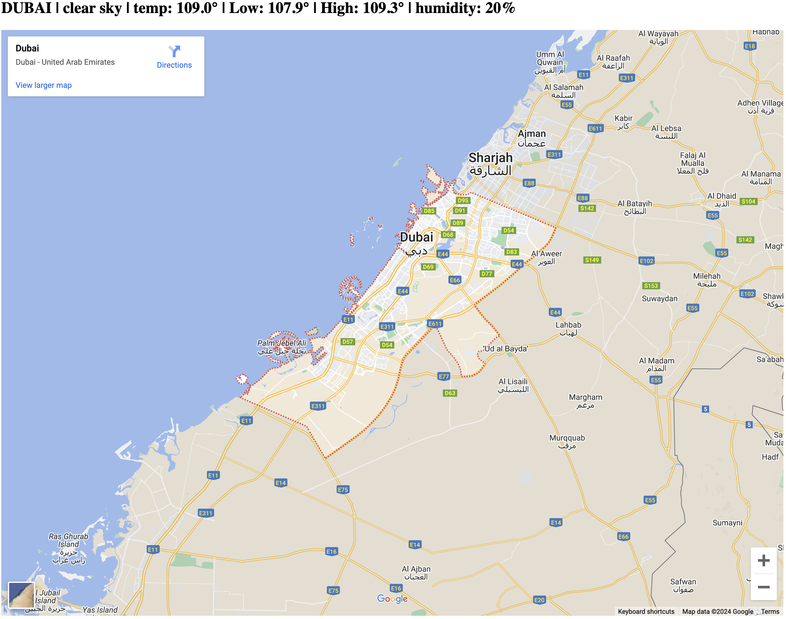
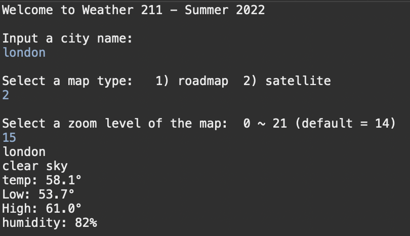

# Weather API

Welcome to my Weather API!

## Table of Contents
  - [Overview](#overview)
  - [App File Structure](#app-file-structure)
  - [Features](#features)
  - [Screenshots](#screenshots)
  - [Technologies Used](#technologies-used)
  - [Installation and Operation](#installation-and-operation)
    - [1. Get API Keys](#1-get-api-keys)
    - [2. Install IDE and JDK](#2-install-ide-and-jdk)
    - [3. Add Your API KEYS](#3-add-your-api-keys)
    - [4. Run the Program](#4-run-the-program)
  - [Future Considerations](#future-considerations)
## Overview

This application prompts the user for a city among other customization inputs which are used with Google Maps and Openweathermap API to gather map/weather details. Weather/map information is delivered to the user via the console and a pop-up html.

## App File Structure
The following is a brief overview of the file structure

[./src/main/java](https://github.com/voyagerfan/Arithmetic-Expression-Evaluator/tree/main/src) - All Java files.

[./src/main/java/myWeatherapp.java](https://github.com/voyagerfan/Weather-API/blob/main/src/main/java/myWeatherApp.java) - Main entry point for the program

[./src/main/java/map211.java](https://github.com/voyagerfan/Weather-API/blob/main/src/main/java/map211.java) - Accepts weather array data generated from weather211.java and creates an HTML.

[./src/main/weather211.java](https://github.com/voyagerfan/Weather-API/blob/main/src/main/java/weather211.java) - Calls the openweather API and with user provided info, parses json and consolidates weather data into an array which is consumed by map211.java


## Features

The program includes the following features:

* Maven architecture for simplified builds and dependency management.
* Usage of keys for enhanced API security
* Customization options for map types and zoom level
* Dual display of information (console and pop up HTML)

## Screenshots

Console input/output for city="dubai"



HTML output for city="dubai



Console input/output for city="london"



HTML output for city="london"


## Technologies Used

- **Programming Languages:** Java
- **3rd Party API's:** Google Maps, openweathermap
- **Tools:** Eclipse

## Installation and Operation

*Prerequistes:* **Java Development kit**, **an IDE**, **Google Maps API Key**, **Openweathermaps API Key**

### 1. Get API Keys
1) Obtain a Opeweathermaps API Key:
   * Sign up for an account with openweathermap.org [HERE](https://home.openweathermap.org/users/sign_up)
   * Once you've created an account, you can click on the "API Keys" tab from your account page to view your API key.
2) Obtain a Google Maps API Key:
    * Instructions for retrieve a key are [HERE](https://developers.google.com/maps/documentation/javascript/get-api-key)
    * Follow the instructions for "console"  

### 2. Install IDE and JDK

1) To run this program, you will need to install an IDE (e.g. [Eclipse](https://www.eclipse.org/downloads/) or [IntelliJ](https://www.jetbrains.com/help/idea/installation-guide.html#toolbox)) and the [Java Development Kit (JDK)](https://www.oracle.com/java/technologies/downloads/).

2) Once you have installed an IDE and JDK, you may clone the repo and open the project folder or create your own project and copy the java files from the [src](https://github.com/voyagerfan/Arithmetic-Expression-Evaluator/tree/main/src) folder. 

### 3. Add Your API KEYS

1) Add Google Maps API Key
   * From your IDE, open map211.java
   * Locate the variable "MapAPIKey"
   * Replace "Enter API Key here" with your Google Maps key.
   * Ensure that your key is enclosed in quotes and save changes (e.g. File -> **Save**)
    ```java
    // example, key = 47959THngkndh84u1
    static String MapAPIKey ="47959THngkndh84u1";
    ```
 
2) Add your Openweather API key
   *  From your IDE, open weather211.java
   *  Locate the variable "String secondPartURL"
   *  Replace "Enter API Key Here" with you openweathermap key.
    ```java
    // example, key = HnFddeQ043Tt321 
    String secondPartURL ="&appid=HnFddeQ043Tt321";
    ```
### 4. Run the Program
For your IDE, you may now run the program.

## Future Considerations
While this program provides some key user features and highlights basic programming concepts, it is limited in terms of UI/UX, practical deployment and input handling robustness. These limitations have prompted the consideration of the following improvements:

* Functional Enhancements
  * Allow a user to choose their desired weather data (current selections are hard coded).
  * Integrate additional map options to enhance customizability (e.g. map overlays)
* UI improvements
  * Moving the UI to a GUI
  * Allow the user to enter their keys through the GUI instead of directly modifying java files.
* Error Handling
  * Implement programatic restrictions on user input ranges with appropriate messaging to the user.
* Packaging of program
  * Add executables for Windows and Mac
  * Potentially deploy a web version of the application.
  * Add an option to run the program with a jar file.


